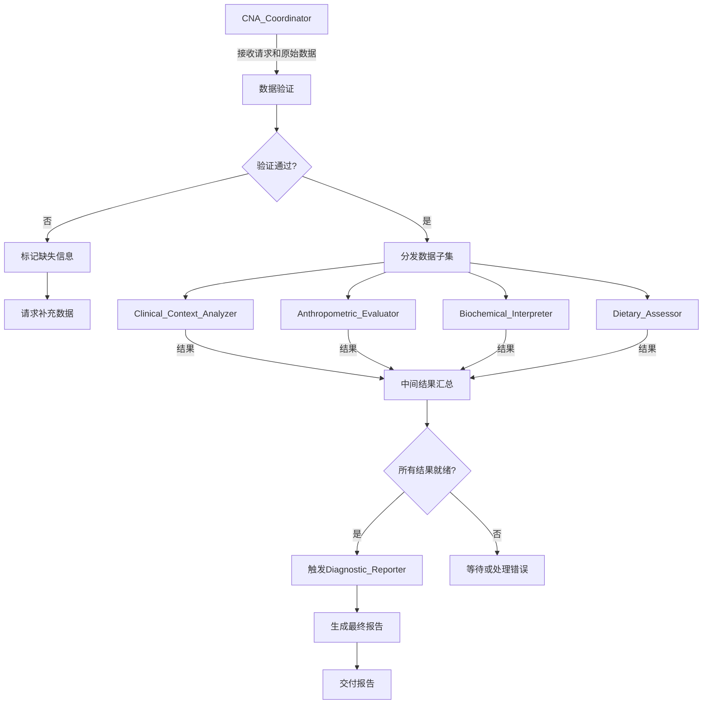

# 智能体工作流

1. **启动与数据接收 (由 `CNA_Coordinator` 主导):**
    - **初始请求**: 整个流程始于 `CNA_Coordinator` 接收到评估请求以及患者的原始数据。
    - **数据验证**: `CNA_Coordinator` 验证数据的完整性和基本格式：
      - 如果数据完整，进入下一步
      - 如果数据缺失关键信息，标记缺失部分并请求补充

2. **任务分发与并行处理:**
    - **数据子集分发**: `CNA_Coordinator` 将相关数据分发给各智能体：
      - `Clinical_Context_Analyzer`: 医疗状况数据
      - `Anthropometric_Evaluator`: 身体测量数据
      - `Biochemical_Interpreter`: 实验室检测结果
      - `Dietary_Assessor`: 膳食摄入数据
    - **并行分析**: 各智能体独立执行分析任务

3. **信息交互与依赖管理:**
    - **信息共享**: `Clinical_Context_Analyzer` 的结果直接提供给 `Biochemical_Interpreter`（当需要时）
    - **序列控制**: `CNA_Coordinator` 确保生化解读在疾病背景分析之后进行

4. **中间结果汇总:**
    - `CNA_Coordinator` 收集所有智能体的结构化结果
    - 如果结果不完整或存在冲突，协调重新分析或请求补充数据

5. **错误处理机制:**
    - **智能体失败**: 如果某个智能体执行失败，`CNA_Coordinator` 会：
      1. 记录错误详情
      2. 尝试重新分配任务
      3. 如果多次失败，在最终报告中添加警告
    - **数据不足**: 如果关键数据缺失且无法补充，在报告中明确说明限制
    - **结果冲突**: 协调相关智能体重新分析或人工介入

6. **触发诊断与报告生成:**
    - **触发条件**: 所有关键结果就绪且通过验证
    - **报告生成**: `Diagnostic_Reporter` 进行诊断并生成报告，应该是结构化的PES声明，例如：
  "nutritional_diagnosis": {
  "problem": "蛋白质-能量摄入不足 (Inadequate protein-energy intake)",
  "etiology": "与疾病相关的高代谢状态和化疗引起的恶心呕吐有关",
  "signs_symptoms": [
    "过去一周能量摄入仅为估算需求的60%",
    "3个月内非意愿性体重下降8%",
    "血清白蛋白 28 g/L (在CRP升高背景下)",
    "NRS2002评分为5分"
  ]
}
  
  7. **最终报告交付:**
    - `CNA_Coordinator` 交付最终报告：
  