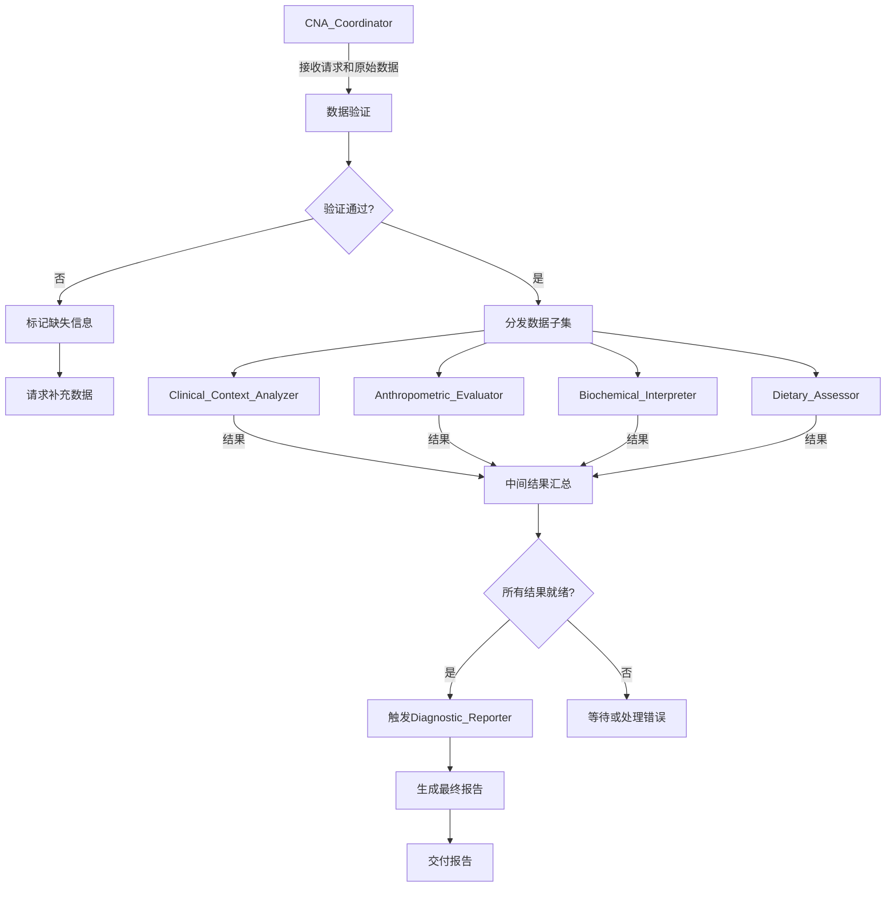

# 智能综合营养评估系统 (CNA) 项目规范

## 项目概述
本项目是一个基于多智能体系统的综合营养评估应用，使用 Gemini AI 模型进行营养诊断和报告生成。

## 技术栈
- **项目架构**: 
  - 前端文件放在`src`目录中
  - 后端Python智能体代码放在`backend`目录中
  - 使用**Next.js API路由**作为前端与后端智能体之间的桥梁
- **前后端交互流程**:
  1. 前端(React)将患者数据(JSON格式)发送到Next.js API路由(`/src/app/api/assessment`)
  2. API路由通过子进程调用Python脚本(`/backend/main.py`)
  3. Python autogen工作流运行，完成评估
  4. 最终报告通过stdout返回给API路由
  5. API路由将结果返回给前端
- **前端框架**: **Next.js 14.2.30 (App Router模式)**
- **UI库**: **React 18**
- **样式库**: **Tailwind CSS 3.4.1**
- **前端编程语言**: **TypeScript 5**
- **后端智能体框架**: **autogen (微软多智能体框架)**
- **后端编程语言**: **Python 3.9+**
- **AI 模型策略**:
  - **`gemini-2.5-pro`**: 用于报告生成(`Diagnostic_Reporter`)
  - **`gemini-2.5-flash`**: 用于中间分析步骤(`CNA_Coordinator`和其他分析智能体)
- **虚拟运行环境**: Conda
- **包管理器**: 
  - 前端: **npm**
  - 后端: **pip**

## 项目结构
```
项目根目录/
├── src/                           # 前端源代码
│   ├── app/                      # Next.js App Router
│   │   ├── layout.tsx           # 根布局组件
│   │   ├── page.tsx             # 主页面组件
│   │   ├── globals.css          # 全局样式
│   │   └── api/                 # API路由
│   │       └── assessment/      
│   │           └── route.ts     # 评估API路由
│   ├── components/              # React组件
│   │   └── ReportDisplay.tsx    # 报告显示组件
│   ├── lib/                     # 工具函数库(预留)
│   └── types/                   # TypeScript类型定义(预留)
│
├── backend/                      # 后端Python代码
│   ├── main.py                  # 主入口文件
│   ├── demo_main.py             # 演示版本(无需API密钥)
│   ├── test_system.py           # 系统测试脚本
│   ├── config.py                # 配置管理
│   ├── requirements.txt         # Python依赖
│   ├── agents/                  # 智能体模块
│   │   ├── base_agent.py        # 智能体基类
│   │   ├── cna_coordinator.py   # 中央协调器
│   │   ├── clinical_context_analyzer.py     # 临床背景分析
│   │   ├── clinical_context_analyzer_v2.py  # 临床背景分析v2
│   │   ├── anthropometric_evaluator.py      # 人体测量评估
│   │   ├── biochemical_interpreter.py       # 生化指标解读
│   │   ├── dietary_assessor.py              # 膳食评估
│   │   └── diagnostic_reporter.py           # 诊断报告生成
│   └── utils/                   # 工具函数(预留)
│
├── public/                      # 静态资源目录
├── node_modules/                # Node.js依赖(自动生成)
│
├── 配置文件
│   ├── package.json             # 前端依赖和脚本
│   ├── package-lock.json        # 依赖锁定文件
│   ├── tsconfig.json            # TypeScript配置
│   ├── next.config.mjs          # Next.js配置
│   ├── tailwind.config.ts       # Tailwind CSS配置
│   ├── postcss.config.js        # PostCSS配置
│   ├── next-env.d.ts            # Next.js类型定义
│   ├── .env                     # 环境变量模板
│   ├── .env.local               # 本地环境变量(含API密钥)
│   └── CLAUDE.md                # 项目规范文档
│
└── 测试文件
    └── test_patient_data.json   # 测试用患者数据
```

## 智能体系统架构

### 1. CNA_Coordinator (中央协调器)
- **角色**: 评估过程的中央管理者
- **任务**:
  - 接收初始请求和所有原始患者数据（疾病状态、筛查结果、实验室报告、饮食记录、人体测量数据、代谢测试结果）
  - 验证输入数据的完整性和基本格式。标记关键缺失信息
  - 通过向专门的智能体分发相关的数据子集来启动评估过程
  - 管理智能体之间的信息序列和流转（例如，确保生化解读考虑疾病背景）
  - 从专门智能体收集中间结果
  - 当处理了足够的信息后，触发 `Diagnostic_Reporter`（诊断与报告智能体 - 专家智能体）
  - 请求 `Diagnostic_Reporter`（诊断与报告智能体 - 专家智能体）生成结构化的PES声明
  - 数据追溯性管理：Coordinator应为每一条数据和每一个分析结论都打上唯一的ID或标签。这样，在最终报告中，任何一个结论（如"存在重度营养不良"）都可以一键追溯到是哪个智能体（如Diagnostic_Reporter）基于哪些中间结论（如Anthropometric_Evaluator报告的"体重下降11%"和Dietary_Assessor报告的"能量摄入不足"）得出的，而这些中间结论又能追溯到原始的JSON输入数据
  - 交付最终的、整合的 CNA 报告

### 2. Clinical_Context_Analyzer (临床背景分析)
- **角色**: 解读患者的基础医疗状况及其营养影响
- **任务**:
  - 分析主要诊断、合并症、严重程度、急慢性状态（急性/慢性）以及当前治疗（手术、化疗、放疗、药物）
  - 识别潜在的与疾病相关的营养影响:高代谢状态、炎症(可使用CRP、临床体征判断)、吸收不良、器官功能障碍（肝、肾）、营养素丢失增加
  - 结合疾病背景解读营养风险筛查评分(例如 NRS-2002, MUST)
  - 解读病历文书和会诊记录，如果有多份病历文书和会诊记录，注意病历文书和会诊记录的编号（一般越新的报告编号越靠前）
  - 向 `CNA_Coordinator` 提供临床背景摘要、估计的应激/炎症水平以及潜在的营养不良病因因素（依据 GLIM 标准的疾病负荷/炎症），也可能直接提供给其他相关智能体（如 `Biochemical_Interpreter`）

### 3. Anthropometric_Evaluator (人体测量评估)
- **角色**: 处理和解读身体测量数据
- **任务**:
  - 计算或获取 BMI 并与年龄/人群特定的标准(例如 WHO、亚洲标准、老年人界值)进行比较
  - 计算指定时间段内（例如 1 周、1 个月、3 个月、6 个月）的体重变化百分比，并评估其显著性（有意/无意）
  - 解读其他测量值，如腰围、上臂围、肱三头肌皮褶厚度、小腿围，并对照参考数据以评估脂肪储存和身体蛋白质（肌肉）状况
  - 如果可用，解读身体成分数据(例如来自 BIA、DXA)，重点关注肌肉量(例如，去脂体重指数 - FFMI,骨骼肌指数 - SMI)
  - 识别是否满足营养不良的表型标准(依据 GLIM 的低 BMI、体重减轻、肌肉量减少),并量化其严重程度
  - 向 `CNA_Coordinator` 报告结构化的结果(例如,"严重非意愿性体重减轻:3 个月内 11%","BMI 17.5 kg/m²","基于小腿围百分位数判断为肌肉量低下")

### 4. Biochemical_Interpreter (生化指标解读)
- **角色**: 分析与营养状况相关的实验室数据
- **任务**:
  - 解读血清蛋白水平（白蛋白、前白蛋白、转铁蛋白），*同时考虑* `Clinical_Context_Analyzer` 提供的背景信息（尤其是炎症标志物如 CRP,以及水合状态）。区分因营养不良导致的低水平与因炎症/液体转移导致的低水平
  - 评估与营养相关的免疫功能标志物（例如，总淋巴细胞计数）
  - 评估相关的维生素和矿物质水平(如果检测了,例如,铁代谢研究、B12、叶酸、维生素 D、锌、镁)
  - 评估电解质平衡以及肾/肝功能标志物，因为它们影响营养治疗和状态
  - 解读营养代谢检测结果(如果可用),例如通过间接测热法测量的静息能量消耗(REE)比较测量值与预测值,和用于了解底物利用情况的呼吸商(RQ)
  - 如果有多分生化检查报告，注意生化检查报告的编号（一般越新的报告编号越靠前）
  - 向 `CNA_Coordinator` 报告结构化的结果（例如，"低前白蛋白 (12 mg/dL) 可能与高炎症状态 (CRP 150 mg/L) 及潜在的摄入不足有关"，"存在缺铁性贫血证据"，"测量的 REE 表明存在高代谢状态 - 为预测值的 135%"）

### 5. Dietary_Assessor (膳食评估)
- **角色**: 评估患者的食物和营养素摄入量
- **任务**:
  - 根据年龄、性别、体重、活动水平和临床背景（`Clinical_Context_Analyzer` 提供的应激/疾病因素）估算患者的能量、蛋白质、液体以及可能关键的微量营养素需求量
  - 分析膳食摄入数据(例如,24 小时回顾、食物频率问卷、热量计算、报告的膳食摄入百分比)
  - 计算能量、蛋白质和其他相关营养素的日均摄入量
  - 将摄入量与估算需求量进行比较，以判断是否充足（例如，"满足需求的百分比"）
  - 识别饮食的定性方面（例如，饮食质地、食物不耐受、对补充剂的依赖、进食障碍）
  - 确定是否满足营养不良的病因标准（依据 GLIM 的食物摄入减少/吸收障碍）
  - 向 `CNA_Coordinator` 报告结构化的结果（例如，"过去一周平均能量摄入估计为需求的 55%"，"蛋白质摄入 0.7 克/公斤/天，低于 1.2 克/公斤/天的估计需求"，"报告有早饱感和恶心影响摄入"）

### 6. Diagnostic_Reporter (诊断报告专家)
- **角色**: 整合所有分析结果，进行营养诊断，并生成最终的综合评估报告
- **任务**:
  - 接收来自 CNA_Coordinator 的所有专家智能体的汇总分析结果
  - 应用诊断标准 (如 GLIM)： 评估表型和病因标准，确定营养不良诊断及其严重程度
  - 识别主要的营养问题
  - 格式化并生成综结构化的PES声明
  - 将结构化的PES声明输出给 CNA_Coordinator

## 工作流程



### 详细流程说明

1. **启动与数据接收 (由 `CNA_Coordinator` 主导)**:
    - **初始请求**: 整个流程始于 `CNA_Coordinator` 接收到评估请求以及患者的原始数据
    - **数据验证**: `CNA_Coordinator` 验证数据的完整性和基本格式：
      - 如果数据完整，进入下一步
      - 如果数据缺失关键信息，标记缺失部分并请求补充

2. **任务分发与并行处理**:
    - **数据子集分发**: `CNA_Coordinator` 将相关数据分发给各智能体：
      - `Clinical_Context_Analyzer`: 医疗状况数据
      - `Anthropometric_Evaluator`: 身体测量数据
      - `Biochemical_Interpreter`: 实验室检测结果
      - `Dietary_Assessor`: 膳食摄入数据
    - **并行分析**: 各智能体独立执行分析任务

3. **信息交互与依赖管理**:
    - **信息共享**: `Clinical_Context_Analyzer` 的结果直接提供给 `Biochemical_Interpreter`（当需要时）
    - **序列控制**: `CNA_Coordinator` 确保生化解读在疾病背景分析之后进行

4. **中间结果汇总**:
    - `CNA_Coordinator` 收集所有智能体的结构化结果
    - 如果结果不完整或存在冲突，协调重新分析或请求补充数据

5. **错误处理机制**:
    - **智能体失败**: 如果某个智能体执行失败，`CNA_Coordinator` 会：
      1. 记录错误详情
      2. 尝试重新分配任务
      3. 如果多次失败，在最终报告中添加警告
    - **数据不足**: 如果关键数据缺失且无法补充，在报告中明确说明限制
    - **结果冲突**: 协调相关智能体重新分析或人工介入

6. **触发诊断与报告生成**:
    - **触发条件**: 所有关键结果就绪且通过验证
    - **报告生成**: `Diagnostic_Reporter` 进行诊断并生成报告，应该是结构化的PES声明，例如：
    ```json
    "nutritional_diagnosis": {
      "problem": "蛋白质-能量摄入不足 (Inadequate protein-energy intake)",
      "etiology": "与疾病相关的高代谢状态和化疗引起的恶心呕吐有关",
      "signs_symptoms": [
        "过去一周能量摄入仅为估算需求的60%",
        "3个月内非意愿性体重下降8%",
        "血清白蛋白 28 g/L (在CRP升高背景下)",
        "NRS2002评分为5分"
      ]
    }
    ```

7. **最终报告交付**:
    - `CNA_Coordinator` 交付最终报告

## 最终报告结构
由 `CNA_Coordinator` 完成最终综合营养报告需要严格按照以下几方面内容构成：

1. **患者基本情况摘要**
    主要包含内容为患者的现有临床诊断与病情变化

2. **营养风险等级**
    主要内容为患者nrs2002风险评估结果

3. **关键评估发现**
    1. 包括生化评估、临床评估、人体测量评估、膳食评估
    2. 若有提供患者人体测量结果，应描述评估结果和理想情况之间的差距

4. **营养诊断**
    列出患者关于营养不良的诊断条目或营养量表评估结果

5. **主要营养问题**
    内容包含患者目前存在的主要营养问题

6. **营养治疗目标**
    1. 使用 **SMART 原则** 制定具体、可衡量、可实现、相关且有时限的目标
    2. 示例：
        - "在 1 周内，将每日能量摄入从当前 1000 kcal 提高到 1800 kcal"
        - "在 2 周内，将血清白蛋白水平从 2.8 g/dL 提升至 3.2 g/dL"
        - "在 3 个月内，体重增加 5%"

7. **营养干预措施**
    给出具体的营养治疗措施

`CNA_Coordinator`可能会接到其他子智能体多维度的信息，在最终结果中不要单纯罗列每个智能体的报告，`CNA_Coordinator`的任务是整合各类子智能体报告并生成综合营养评估结果供人类医生阅读参考。

## 前后端交互详解

### 前端数据提交流程
```typescript
// src/app/page.tsx - 核心提交逻辑
const handleSubmit = async () => {
    // 1. JSON格式验证
    let parsedData;
    try {
        parsedData = JSON.parse(patientData);
    } catch (error) {
        setAssessmentResult(`JSON格式无效: ${error.message}`);
        return;
    }
    
    // 2. 发送POST请求到API路由
    const res = await fetch("/api/assessment", {
        method: "POST",
        headers: { "Content-Type": "application/json" },
        body: JSON.stringify(parsedData)
    });
    
    // 3. 处理响应
    const result = await res.json();
    if (result.report) {
        setAssessmentResult(result.report);
    }
};
```

### API路由处理机制
```typescript
// src/app/api/assessment/route.ts - 进程通信核心
export async function POST(request: Request) {
    const patientData = await request.json();
    
    // 启动Python子进程
    const pythonProcess = spawn('python3', ['main.py'], {
        cwd: path.join(process.cwd(), 'backend')
    });
    
    // 通过stdin传递数据
    pythonProcess.stdin.write(JSON.stringify(patientData));
    pythonProcess.stdin.end();
    
    // 通过stdout接收结果
    pythonProcess.stdout.on('data', (data) => {
        reportData += data.toString();
    });
    
    // 返回结果
    return NextResponse.json(JSON.parse(reportData));
}
```

### Python后端接收处理
```python
# backend/main.py - 数据接收和处理
if __name__ == "__main__":
    # 从stdin读取数据
    input_data = sys.stdin.read()
    parsed_data = json.loads(input_data)
    
    # 数据整合(支持单个对象或文档列表)
    if isinstance(parsed_data, list):
        patient_json = consolidate_patient_data(parsed_data)
    else:
        patient_json = parsed_data
    
    # 初始化协调器并运行评估
    coordinator = CNA_Coordinator(
        patient_json, 
        llm_config_pro, 
        llm_config_flash
    )
    result = coordinator.run_assessment()
    
    # 输出结果到stdout
    print(json.dumps(result, ensure_ascii=False))
```

## 环境配置详解

### 前端依赖清单
```json
{
  "dependencies": {
    "next": "14.2.30",
    "react": "^18",
    "react-dom": "^18"
  },
  "devDependencies": {
    "@types/node": "^20",
    "@types/react": "^18",
    "@types/react-dom": "^18",
    "autoprefixer": "^10.4.19",
    "eslint": "^8",
    "eslint-config-next": "14.2.3",
    "postcss": "^8",
    "tailwindcss": "^3.4.1",
    "typescript": "^5"
  }
}
```

### 后端Python依赖
```text
# backend/requirements.txt
pyautogen              # AutoGen智能体框架
python-dotenv          # 环境变量管理
openai                 # OpenAI API客户端
google-genai           # Google Gemini AI客户端
vertexai               # Google Vertex AI
Pillow                 # 图像处理
jsonschema             # JSON验证
httpx>=0.28.1          # 异步HTTP客户端
certifi>=2025.6.15     # SSL证书验证
```

### 环境变量配置
```bash
# .env文件(模板)
GEMINI_API_KEY=your_gemini_api_key_here

# .env.local文件(实际使用，不提交到版本控制)
GEMINI_API_KEY=AIzaSyXXXXXXXXXXXXXXXXXXXXXXXX
NEXT_PUBLIC_APP_NAME=智能综合营养评估系统
```

## Gemini配置

### 模型使用策略
| 智能体 | 模型 | Temperature | 用途 |
|--------|------|-------------|------|
| CNA_Coordinator | gemini-2.5-flash | 0.5 | 协调管理、冲突检测 |
| Clinical_Context_Analyzer | gemini-2.5-flash | 0.5 | 临床背景分析 |
| Anthropometric_Evaluator | gemini-2.5-flash | 0.5 | 人体测量评估 |
| Biochemical_Interpreter | gemini-2.5-flash | 0.5 | 生化指标解读 |
| Dietary_Assessor | gemini-2.5-flash | 0.5 | 膳食评估 |
| Diagnostic_Reporter | **gemini-2.5-pro** | 0.7 | 最终报告生成 |

### API配置
```python
# backend/config.py
llm_config_pro = {
    "config_list": [{
        "model": "gemini-2.5-pro",
        "api_key": GEMINI_API_KEY,
        "api_type": "google"
    }],
    "temperature": 0.7
}

llm_config_flash = {
    "config_list": [{
        "model": "gemini-2.5-flash",
        "api_key": GEMINI_API_KEY,
        "api_type": "google"
    }],
    "temperature": 0.5
}
```

### 请求体格式
```json
{
  "model": "models/gemini-2.5-pro",
  "prompt": {
    "text": "您的提示内容"
  }
}
```

### 提示工程最佳实践
1. 使用结构化 JSON 格式传递患者数据
2. 明确指定输出格式要求
3. 提供上下文信息（如评估类型、报告格式要求）
4. 分步骤引导模型思考过程

### 错误处理
- 网络错误: 重试机制(最多3次)
- API错误: 检查错误代码和消息
- 生成错误: 验证输出格式和完整性

## 数据格式规范

### 输入数据格式
输入的患者信息以以下JSON格式呈现（仅供参考）：
```json
{
  "document_type": "综合病例",
  "patient_info": {
    "height_cm": 164,
    "weight_kg": 55,
    "bmi": 20.45
  },
  "diagnoses": [
    { "type": "入院诊断", "description": "1. 陈旧性下壁心肌梗死" },
    { "type": "入院诊断", "description": "2. 冠状动脉粥样硬化性心脏病" },
    { "type": "目前诊断", "description": "1. 冠状动脉粥样硬化性心脏病 急性非ST段抬高型心肌梗死 Killip I级" }
  ],
  "symptoms_and_history": {
    "chief_complaint": "缘于入院前10天无明显诱因出现活动后胸闷、胸痛",
    "history_of_present_illness_summary": "患者10天前出现活动后胸闷胸痛，为心前区压榨痛，向左下肢放射，伴大汗，持续数分钟后可自行缓解。入院诊断为\"陈旧性下壁心梗、冠心病\"等。诊疗经过包括冠脉造影及支架植入术（LAD、RCA）。目前高钾状态。"
  },
  "lab_results": {
    "biochemistry": [
      { "name": "白蛋白", "value": "34.30", "unit": "g/L", "interpretation": "↓" },
      { "name": "C-反应蛋白", "value": "292.80", "unit": "mg/L", "interpretation": "↑" }
    ],
    "complete_blood_count": [
      { "name": "白细胞计数", "value": "10.04", "unit": "10^9/L", "interpretation": "↑" },
      { "name": "血红蛋白", "value": "85", "unit": "g/L", "interpretation": "↓" }
    ],
    "stool_routine": [
      { "name": "隐血", "value": "阳性", "interpretation": "↑" }
    ]
  },
  "treatment_plan": {
    "summary": "患者行\"DSA下冠脉主动脉造影+PCI术\"，LAD中段、RCA中段各置入支架一枚。术后予以抗凝、抗血小板、抗感染、营养支持等治疗。目前肾功能稳定，转入我科进一步观察治疗。",
    "key_medications": null
  },
  "consultation_record": {
    "department": "临床营养科",
    "purpose": "患者目前胃肠道置入状态，请示贵科评估营养方案。",
    "findings_and_conclusion": "患者身高164cm，体重约55kg，BMI：20.45。近期实验室检查示：白蛋白34.3g/L, 血红蛋白85g/L, 肌酐129.2umol/L, 钠154.3mmol/L。NRS2002评分为存在营养风险，营养评估提示营养不良。",
    "recommendations": "推荐全天总能量1600-1700kcal，蛋白65-70g，早期、中、晚三餐由营养食堂提供低钠配方肠内营养粉，提供能量850kcal，蛋白13.5g。若患者肠内耐受良好，可在两餐中间喂养能全素。",
    "NRS2002_score": 4,
    "PES_statement_summary": "营养评估提示营养不良"
  }
}
```

### 输出数据格式
```json
{
  "report": "格式化的营养评估报告文本",
  "session_id": "唯一会话ID",
  "assessment_time": "2024-01-01T12:00:00Z",
  "processing_duration": 15.5,
  "validation_results": {
    "is_valid": true,
    "missing_fields": [],
    "warnings": []
  },
  "conflict_analysis": {
    "has_conflicts": false,
    "proceed_to_final_report": true
  },
  "trace_summary": {
    "total_steps": 6,
    "final_report_trace_id": "xxx",
    "intermediate_trace_ids": ["id1", "id2", ...]
  }
}
```

## 项目启动指南

### 开发环境启动
```bash
# 1. 克隆项目
git clone [项目地址]
cd [项目目录]

# 2. 安装前端依赖
npm install

# 3. 设置Python环境
conda create -n cna-env python=3.9
conda activate cna-env
pip install -r backend/requirements.txt

# 4. 配置环境变量
cp .env .env.local
# 编辑.env.local，填入GEMINI_API_KEY

# 5. 启动开发服务器
npm run dev
# 访问 http://localhost:3000
```

### 生产环境部署
```bash
# 1. 构建前端
npm run build

# 2. 启动生产服务器
npm run start
```

### 可用脚本
```bash
# 前端相关
npm run dev      # 启动开发服务器
npm run build    # 构建生产版本
npm run start    # 启动生产服务器
npm run lint     # 代码检查

# 后端测试
python backend/main.py           # 运行主程序(需要stdin输入)
python backend/demo_main.py      # 运行演示版本(无需API密钥)
python backend/test_system.py    # 运行系统测试
```

## 关键特性

### 1. 数据追溯性
- 每个分析步骤生成唯一trace_id
- 完整的数据流转记录
- 任何结论都可追溯到：
  - 生成该结论的智能体
  - 使用的输入数据
  - 依赖的其他结论
  - 原始患者数据

### 2. 智能冲突检测
- 使用AI分析各智能体结果的一致性
- 自动识别矛盾信息
- 决策流程透明化

### 3. 双模型策略
- Flash模型处理大量中间任务(成本优化)
- Pro模型生成最终报告(质量保证)
- Temperature参数差异化设置

### 4. 演示模式
- `demo_main.py`无需API密钥
- 生成模拟报告用于测试和演示

### 5. 模块化设计
- 每个智能体独立文件
- 继承自统一基类
- 便于测试和维护

## 代码规范

### 命名约定
- **React 组件**: PascalCase (如 `VocabularyCard`)
- **函数**: camelCase (如 `formatWord`)
- **变量**: camelCase (如 `userWords`)
- **常量**: UPPER_SNAKE_CASE (如 `MAX_WORDS`)
- **Python类**: PascalCase (如 `CNA_Coordinator`)
- **Python函数**: snake_case (如 `run_assessment`)
- **Python变量**: snake_case (如 `patient_data`)

### 组件规范
- 除非有特殊理由，否则优先使用**函数式组件**和**箭头函数**语法
- 优先考虑使用 React 的 `useState` 和 `useEffect` 进行组件级别的状态管理。如果需要更复杂的状态管理，请根据具体情况考虑 `useContext` 或其他的轻量级状态管理库
- 在进行 API 调用和处理用户输入时，务必进行适当的**错误处理**

### 样式规范
- **Tailwind CSS 优先**: 在编写组件样式时，**始终优先使用 Tailwind CSS 的工具类**直接在 JSX 中进行样式化
- **自定义 CSS**: 如果需要自定义 CSS，请尽量通过在 `tailwind.config.js` 中扩展 Tailwind 的配置，或者使用 Tailwind 的 **`@apply` 指令**来组合 Tailwind 的工具类。避免编写大量的完全自定义的 CSS
- **Tailwind 配置**: 任何对 Tailwind CSS 的自定义（例如，添加新的颜色、字体、断点）都应该在 `tailwind.config.js` 文件中进行
- **响应式设计**: 在设计页面和组件时，请始终考虑**响应式设计**，并利用 Tailwind CSS 的响应式前缀 (例如，`sm:`, `md:`, `lg:`) 来适配不同的屏幕尺寸

### TypeScript配置
```json
{
  "compilerOptions": {
    "strict": true,
    "jsx": "preserve",
    "moduleResolution": "bundler",
    "paths": {
      "@/*": ["./src/*"]
    }
  }
}
```

## 安全规范
- **禁止修改文件**: `.env*`, 构建目录(`/.next/`, `/build/`), 锁文件(`package-lock.json`)
- **环境变量**: 通过`.env`文件管理敏感信息，`.env.local`不提交到版本控制
- **API密钥**: 安全存储Gemini API密钥，永不硬编码
- **输入验证**: JSON格式验证，数据大小限制(建议1MB)
- **错误信息**: 生产环境避免暴露敏感错误信息

## 性能优化建议

### 1. 并发处理
- 人体测量和膳食评估可并行执行
- 考虑使用Python asyncio优化智能体调用

### 2. 缓存策略
- 相似患者数据结果缓存
- API响应缓存(Redis/内存)

### 3. 超时处理
```typescript
// API路由添加超时
const timeout = setTimeout(() => {
    pythonProcess.kill();
    resolve(NextResponse.json({ error: '处理超时' }, { status: 504 }));
}, 60000); // 60秒超时
```

### 4. 资源限制
- 限制并发请求数
- 设置内存使用上限
- 实现请求队列

## 故障排除

### 常见问题

1. **Python进程启动失败**
   - 检查Python路径：`which python3`
   - 确认虚拟环境激活：`conda activate cna-env`
   - 验证依赖安装：`pip list`

2. **API密钥错误**
   - 检查.env.local文件存在
   - 验证GEMINI_API_KEY格式
   - 确认API密钥有效期

3. **超时错误**
   - 检查网络连接
   - 增加超时时间设置
   - 优化AI提示词长度

4. **JSON解析错误**
   - 使用JSON验证工具检查格式
   - 确保使用UTF-8编码
   - 检查特殊字符转义

## 文档搜索规范
在需要查询 Next.js, Tailwind CSS, autogens, python相关文档时，务必使用 Context7 以获取最新的、版本相关的文档信息：

### Next.js 文档搜索
当需要查询 Next.js 文档时，**搜索 Next.js 的稳定版本文档**。在你的提问中，明确包含 `use context7` 并指明需要 Next.js 的稳定版文档。例如：use context7 搜索 Next.js 稳定版关于路由功能的文档

### Tailwind CSS 文档搜索
当需要查询 Tailwind CSS 文档时，**搜索 Tailwind CSS 的最新版本文档**。在你的提问中，明确包含 `use context7` 并指明需要 Tailwind CSS 的最新文档。例如：use context7 搜索 Tailwind CSS 最新版关于响应式设计的文档

### autogens 文档搜索
当需要查询 autogens 文档时，**autogens 的稳定版本文档**。在你的提问中，明确包含 `use context7` 并指明需要 autogens 的稳定版文档。例如：use context7 搜索autogens 稳定版关于智能体构建的文档

### python 文档搜索
当需要查询 python 文档时，**搜索 python 的最新版本文档**。在你的提问中，明确包含 `use context7` 并指明需要 python 的最稳定文档。例如：use context7 搜索 python 最稳定版。

## 开发要点
1. **前后端分离**: 清晰的架构边界
2. **模块化设计**: 智能体独立可测试
3. **错误处理**: 完备的异常处理机制
4. **代码规范**: 遵循项目约定
5. **质量保证**: 结构化提示工程和SMART目标制定
6. **持续优化**: 根据生成质量迭代改进

## 开发原则
- 所有的回复都使用中文
- 你的用户是一位独立开发者，致力于个人项目或自由职业开发任务
- 遵循架构设计，保持代码风格一致
- 代码修改遵循单一职责原则，不混合多个变更
- 在进行代码设计规划的时候，请符合"第一性原理"
- 在代码实现的时候，请符合"KISS原则"和"SOLID原则"
- 尽量复用已有代码，避免重复代码

## 重要提醒
- 本系统生成的评估报告仅供参考，最终诊断需由专业医生确定
- 请确保患者数据的隐私和安全
- 定期更新AI模型以获得最佳效果
- NEVER create files unless they're absolutely necessary for achieving your goal
- ALWAYS prefer editing an existing file to creating a new one
- NEVER proactively create documentation files (*.md) or README files. Only create documentation files if explicitly requested by the User

## 版本信息
- 文档版本: 2.0
- 更新日期: 2024-12-19
- 项目版本: 0.1.0
- Node.js要求: 18+
- Python要求: 3.9+
- Next.js版本: 14.2.30
- React版本: 18
- Tailwind CSS版本: 3.4.1