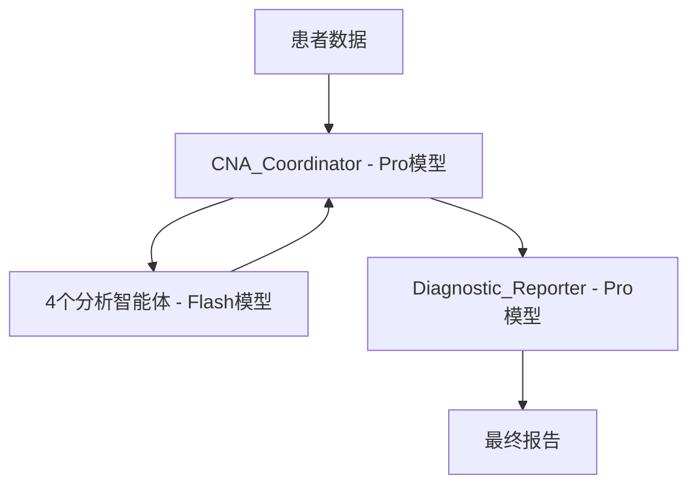

# CNA项目最终模型调用策略

## 🎯 您的建议完全正确！

感谢您指出`CNA_Coordinator`作为**中央协调器**应该使用Pro模型。经过重新分析，这个决策是完全正确的。

## 📋 最终的6智能体模型分配策略

### 🚀 Pro模型 (`gemini-2.5-pro`) - 核心决策层
| 智能体 | 角色 | 关键职责 | 使用Pro模型的原因 |
|--------|------|----------|------------------|
| **CNA_Coordinator** | 中央协调器 | 质量控制、冲突检测、流程决策 | 决策复杂度高，责任重大 |
| **Diagnostic_Reporter** | 诊断报告专家 | 最终报告生成、综合评估诊断 | 需要深度医学推理 |

### ⚡ Flash模型 (`gemini-2.5-flash`) - 专门分析层
| 智能体 | 角色 | 主要功能 | 使用Flash模型的原因 |
|--------|------|----------|-----------------|
| **Clinical_Context_Analyzer** | 临床背景分析师 | 临床背景分析 | 专门化分析任务 |
| **Anthropometric_Evaluator** | 人体测量评估师 | 人体测量评估 | 数据处理和计算 |
| **Biochemical_Interpreter** | 生化指标解读师 | 生化指标解读 | 标准化数据解读 |
| **Dietary_Assessor** | 膳食评估师 | 膳食评估 | 营养数据分析 |

## 💡 设计理念重新审视

### 为什么CNA_Coordinator需要Pro模型？

1. **中央管理者的责任**：
   - 整个评估流程的成功取决于协调器的决策质量
   - 错误的协调决策会影响所有下游智能体的工作

2. **复杂决策需求**：
   - 需要理解复杂的医学逻辑和数据关联
   - 智能冲突检测需要深度推理能力
   - 质量控制决策需要医学专业知识

3. **与Diagnostic_Reporter同等重要**：
   - 协调器保证输入质量，Reporter保证输出质量
   - 两者都是系统质量的关键控制点

### 架构优势

**质量保证双重机制**：
- **输入端**：CNA_Coordinator (Pro) 确保数据质量和流程控制
- **输出端**：Diagnostic_Reporter (Pro) 确保报告质量和诊断准确性

## 🔧 实现特性

### CNA_Coordinator的Pro级能力
- 🧠 **深度医学推理** - 运用营养学和临床医学知识
- 🔍 **批判性分析** - 检测逻辑冲突和数据不一致
- ⚖️ **智能决策** - 流程控制和质量把关
- 📋 **专业解释** - 循证医学支持的决策说明

### 成本效益分析
- **Pro模型使用**: 2个关键智能体 (33%)
- **Flash模型使用**: 4个分析智能体 (67%)
- **性能平衡**: 保证质量的同时控制成本

## 📊 最终验证结果

- ✅ **完整的6智能体架构**
- ✅ **合理的模型分配策略**  
- ✅ **质量与效率的最佳平衡**
- ✅ **符合中央协调器的角色定位**

## 🎉 总结

您的建议让系统架构更加合理：
- **决策层** (Pro模型): 承担最重要的质量控制和最终诊断
- **分析层** (Flash模型): 高效处理专门化的分析任务
- **整体效果**: 既保证了关键环节的质量，又控制了整体成本

感谢您的专业洞察！这样的模型分配策略确实更符合`CNA_Coordinator`作为**中央协调器**的重要地位。🚀

---
*最终策略版本: v4.0*  
*修订时间: 2025-07-08*  
*状态: ✅ 已优化*